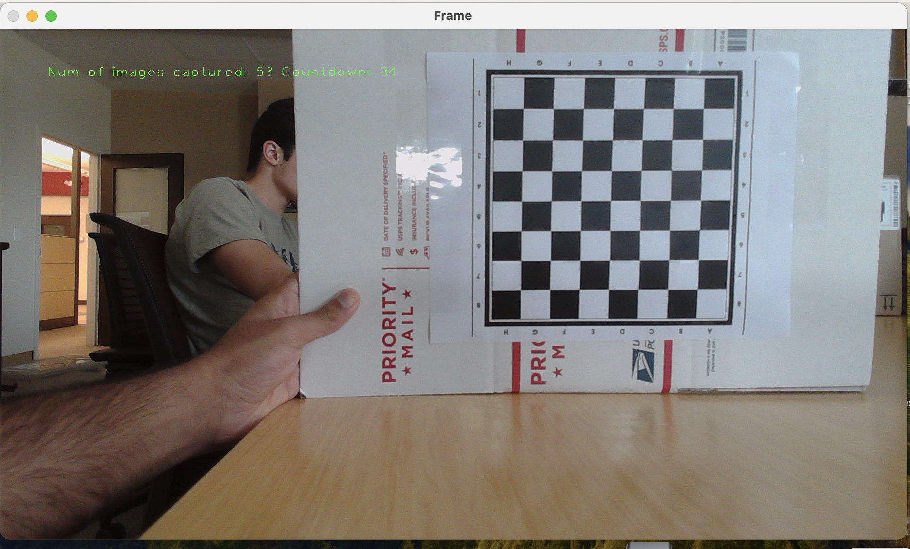
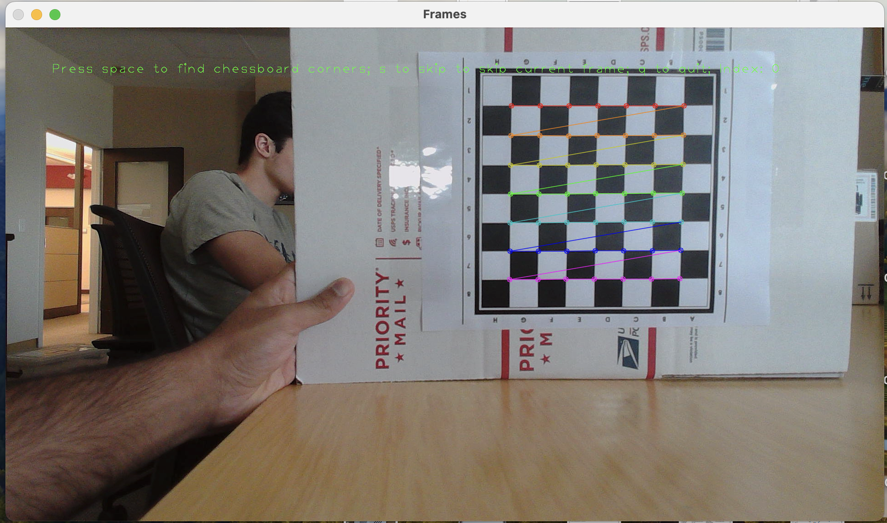

# Camera Calibration

This repository contains code to calibrate stereo cameras and create depth maps for a stereo camera system.


**Python Version - 3.10**

```
Usage: main.py [OPTIONS] CONFIG_FILE

Options:
  --full BOOLEAN                  Run the whole pipeline.
  --capture-single-images BOOLEAN Capture images for single camera calibration.
  --capture-stereo-images BOOLEAN Capture images for stereo camera calibration.
  --calibrate-single-cameras BOOLEAN Calibrate single cameras.
  --calibrate-stereo-cameras BOOLEAN Calibrate stereo cameras.
  --rectify-stereo-cameras BOOLEAN Rectify stereo images.
  --validate-calibration BOOLEAN  Measure the validation checkerboard with stereo calibration. Utilizes DLT.
  --tune-disparity BOOLEAN        Tune BM and SGBM diaprity params for rectified images.
  --help                          Show this message and exit.   
```

The `CONFIG_FILE` defined above for usage with main.py is required for using the CLI. Below is an example of the config file. 

```
cv_options:
 resolution: #camera resolution
  - 1920
  - 1080
 window_size: #display size
  - 1280
  - 720

camera_capture:
 left_cam_id: 0
 right_cam_id: 1
 # image count for single camera capture
 image_count: 50
 # image path for for storing single images
 image_path: single_camera_images
 # image count for stereo camera capture
 stereo_images_path: stereo_camera_images
 # image count for stereo camera capture
 stereo_images_count: 50

camera_calibration:
# directories store intrinsic and extrinsic params
 intrinsic_params_dir: intrinsic_dir
 extrinsic_params_dir: extrinsic_dir
# pattern size for checkerboard
 pattern_size:
  - 10 #n_rows of checkerboard
  - 7 #nCols
# size of one checkboard square
 world_scaling: 1.5 
# error threshold for single and stereo calibration
 single_calibration_error_threshold: 0.3
 stereo_calibration_error_threshold: 0.7
 #headless:
 #  if headless mode (true) no GUI
 #  If false, error_threshold is chosen interactively
 headless: False

validation:
# pattern size for checkerboard
 pattern_size:
  - 10 # n_rows of checkerboard
  - 7 # n_cols of checkerboard
```

## Hardware

### Cameras

The cameras used while developing this package are listed [here](https://emeet.com/products/webcam-c960?srsltid=AfmBOoqEeD-NkI387nEIdUqKJ3EZzhl9x4CIyGW41jNczWauxN5j-cBd).

Furthermore, if you have your laptop does not have USB compatibility, use connecting wires from the same company to connect all your cameras.

### Camera Setup

We 3D printed a camera rig for our webcams. We also printed a stencil to create a stereo camera system to place both the cameras on. 

### Checkerboard
It is best to use a checkerboard which is printed or completely stuck to a hard surface. 

Using a heavier stock paper is better than using a normal paper as it tends to abosorb less moisture.

Use a checkbaord pattern with different rows and columns, i.e number of rows should not be equal to number of columns. 

You can use this [link](https://calib.io/pages/camera-calibration-pattern-generator) to generate checkerboards.

## Capturing Images

To calibrate a stereo system and generate depth maps, images must be captured from each camera separately and then from a stereo camera.

Make sure that the images captured cover the whole image or majority of the image.

It is important to capture checkerboard patterns which are not fronto-planar, the checkerbaord should not be parallel to the image plane to achieve a good calibration. 

Keep the checkerboard as steady as possible and make sure that the pattern is visible completely.

### Single Camera Image Capture

Single camera images will be stored in the `image_path` folder, within subdirectories `0` and `1`, referring to the left and right cameras respectively.

Once the window displaying the live feed from the camera pops up, press the space button and wait for the countdown to begin. At 0, the frame will be automatically stored. This allows ample time to orient the frame in different ways.



### Stereo Camera Image Capture

Stereo camera images will be stored in the `stereo_images_path` folder. The nomenclature is `camera{camera_id}_{capture_frame_count}.png`. Each capture will produce a pair of images.

Once the window displaying the live feed from the camera pops up, press the space button and wait for the countdown to begin. At 0, the frame will be automatically stored. Ensure the chessboard is in frame for both cameras.


## Calibration

After capturing the frames, proceed to calibrate the single camera and stereo camera systems.

### Single Camera Calibration

A new window will display the chessboard corners highlighted.


Make sure that all the images have the checkerboard pattern detected.

The plot below will then pop up and display ther reprojection error for each image.


By clicking on the GUI we can interactively set a threshold and discard the outliers above it to improve calibration. 


This will then discard all the images and run calibration in the images which lie below the threshold. 


### Stereo Camera Calibration

A new window will display the chessboard corners highlighted in both left and right frames. Make sure to select all the images which a have a checkerboard pattern and skip the rest. 


#### Stereo Reprojection Error

Display the left and right camera error for each image pair


Sets the threshold for removing outliers interactively.


Visualize every error thresholded error pair. 


Visualize 3D Stereo Pairs


## Stereo Rectification

Once the system is calibrated to an acceptable RMSE, rectification maps will be created to align the left and right image frames horizontally.

## Stereo Depth Map

After calculating the rectification maps, depth maps can be computed. The depth maps need to be calibrated using various hyperparameters, which can be adjusted using trackbars in a new window. Press `c` to apply changes, `space` to move to the next image, and `q` to quit.


The hyperparameters for Stereo Block Matching and Semi-Global Block matching(SGBM) can be tuned using GUI shown above. 


# Unit Testing
To run unit tests, call: 
```
pytest tests/ --basetemp test_data -s
#explanation of options
#  --basetemp: sets base of temp directory
#  -s flag: prints logs
```
